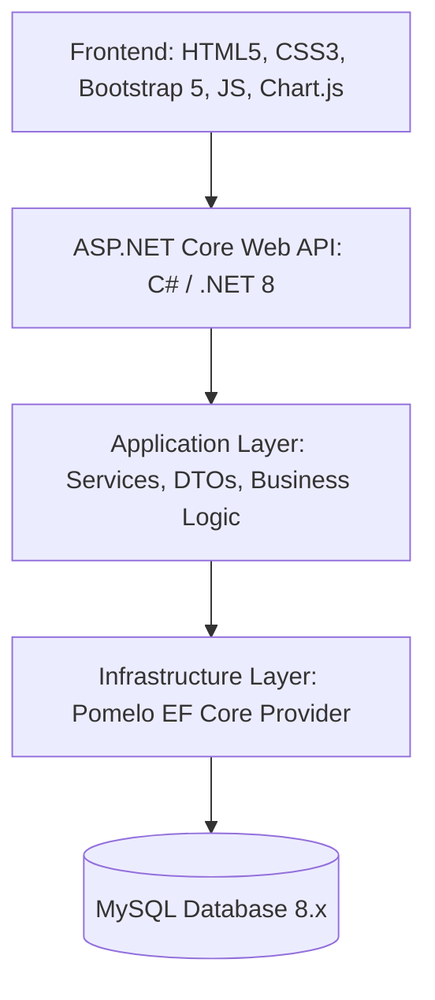

# Architecture — MySQL Version

ShareSync uses a standard ASP.NET Core Clean Architecture.

- **Web API Layer (`ShareSync.Web`):** RESTful controllers, Swagger documentation, JWT bearer authentication middleware, and SPA static file hosting.
- **Application Layer (`ShareSync.Application`):** Core business logic, interfaces, analytical calculations (Investment Intelligence, Portfolio valuation, Reporting).
- **Infrastructure Layer (`ShareSync.Infrastructure`):** Data access via `ShareSyncDbContext`, Pomelo MySQL EF Core provider, BCrypt/PBKDF2 security, and external DSE synchronization.
- **Domain Layer (`ShareSync.Domain`):** Core entity models (`AppUser`, `Portfolio`, `Transaction`, `CompanyPriceHistory`, etc.).
